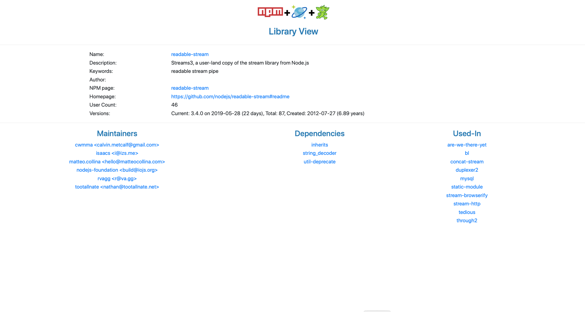

# azure-cosmos-db-graph-npm-bom-sample

An example Bill-of-Material application with NPM data using Azure CosmosDB Graph/Gremlin database.


## Created By

- Chris Joakim, Microsoft, Azure Cloud Solution Architect, Charlotte
- Luis Bosquez, Microsoft, Azure CosmosDB Program Manager, Redmond

## NPM as the Data Source

In our work with Azure CosmosDB we've seen that **Bill-of-Materials (BOM)** is a common use-case for companies,
especially in the manufacturing sector.  The graph of their manufactured products, and their many nested components, 
is perfectly suited for CosmosDB with the Gremlin Graph API.

Industry and company-specific product and component data, however, is both proprietary as well as not immediately relatable
to most readers.  We wanted to create a BOM sample application with data that was **immediately relatable** to most
Information Technology audiences.  Therefore, we chose the domain of **software**, since software end-products are
typically composed of a nested graph of software libraries (i.e. - manufacturing components), and IT audiences innately
understand this.

We considered using NuGet (DotNet), MavenCentral (Java), and PyPI (Python) as the datasource.  But we chose  
[npm (Node Package Manager)](https://www.npmjs.com) in the Node.js and JavaScript ecosystem as Node.js is
fast-growing, appeals to a wide-audience, has great CLI tooling, and CosmosDB itself is JavaScript and JSON oriented.

Given the NPM orientation of this project, Node.js and JavaScript was chosen as the implementation language.
JavaScript is widely supported in Azure PaaS services - such as Azure App Service, Azure Functions, and even
in CosmosDB for server-side Stored Procedures, Triggers, and UDFs.  It is worth noting that the free and cross-platform 
Visual Studio Code editor was used for the development of this project.  Visual Studio Code is itself implemented in Node.js.

## Architecture

This application uses a Azure CosmosDB account, with the Gremlin API, as its sole datastore.  There is a batch process
which "spiders" npm for information about npm libraries, wrangles this JSON data, and then loads it into CosmosDB.
There is also a web application, in the webapp/ directory, built with Node.js and Express which queries and
displays the CosmosDB data.  The open-source JavaScript library [D3.js](https://d3js.org) is used to visualize
the graph data.

The database design includes two graphs, or containers.  One contains the Graph data, with the Vertices being the
NPM Libraries and their Maintainers, with Edges connecting libraries to their dependent libraries.  Edges also
connect the Maintainers to their respective libraries.

The second container in an implementation of the concept of **materialized views**; a set of data pre-aggregated
and pre-processed so as to enable faster queries at runtime.  For example, some of the pre-aggregated data answers
the question: "Where else is this library/component used?" and "What other packages does this Maintainer work on?".
Additionally, the materalized views contain pre-calculated library ages - in days and years, based on their
original and current version dates.  Pre-aggregating data such as this can significantly reduce the **RU usage**
for CosmosDB users, and thus is why we are featuring **materialized views** in this sample BOM project.

What's very interesting about the materialized views in this project is that they are accessed via the **CosmosDB SQL API** 
rather than the **Gremlin API**.  The materialized views are queried efficiently in this project via 
their **partition key attribute** whose name is simply 'pk'.  This is actually a best practice - to name your partition key 
attributes with a generic name like 'pk' or 'partition_key' rather than a given business-oriented attribute name.

This is currently the only case where a single Azure CosmosDB account can be accessed via two programatic APIs;
in this case a Gremlin account accesssed via the Gremlin and SQL APIs.

The advantage of this approach is that your BOM data is in one database, with independent and independently scalable
graph and view collections.  It enables expressive graph traversal via the Gremlin API, and also very efficient  
queries via the SQL API.

See file **webapp/dao/cosmosdb_dao.js** which implements the **DAO Design Pattern** for both the Gremlin and SQL APIs.

---

## Links

- https://azure.microsoft.com/en-us/services/cosmos-db/
- https://docs.microsoft.com/en-us/azure/cosmos-db/gremlin-support
- https://tinkerpop.apache.org/
- https://www.npmjs.com
- https://www.npmjs.com/package/@azure/cosmos
- https://www.npmjs.com/package/gremlin
- https://docs.microsoft.com/en-us/javascript/api/overview/azure/?view=azure-node-latest
- https://github.com/Azure-Samples/azure-cosmosdb-graph-bulkexecutor-dotnet-getting-started

---

## Azure Setup

Provision an Azure CosmosDB instance, in your subscription, which uses the Gremlin API.

Then create a new collection in your CosmosDB Graph database, as shown below.
A database named **dev** with collection named **npm** is recommended.
Specify a partition key named **/pk** and 10,000 RUs.

Also create a second collection named **views** in the **dev** database, 
with a partition key named **/pk** and 10,000 RUs.


Then go to the **Keys panel**, as shown below, and set the following **environment variables** 
on your computer based on the values you see in Azure Portal.


Note, the **values** shown below are just examples; your values will be different.

```
AZURE_COSMOSDB_GRAPHDB_ACCT=cjoakimcosmosdbgremlin
AZURE_COSMOSDB_GRAPHDB_COLNAME=npm
AZURE_COSMOSDB_GRAPHDB_CONN_STRING= ...secret...
AZURE_COSMOSDB_GRAPHDB_DBNAME=dev
AZURE_COSMOSDB_GRAPHDB_GRAPH=npm
AZURE_COSMOSDB_GRAPHDB_VIEWS=views
AZURE_COSMOSDB_GRAPHDB_KEY= ...secret...
AZURE_COSMOSDB_GRAPHDB_URI=https://cjoakimcosmosdbgremlin.documents.azure.com:443/

PORT=3000  (Also add this environment variable for the localhost webserver port)
```

---

## Batch Processing Overview

The batch processing does the following:
1) Starts with a hand-edited list of **seed** npm libraries that are interesting to you.

2) Programatically invoke the **npm cli** to recursively **Spider** npm for information about each library.
   - The spider process starts with your hand-edited list of seed npm libraries
   - The spider will iterate n-number of times to get the **dependencies** of those seed libraries
   - Then dependencies of those libraries, and their dependencies, etc, etc
   - The command **npm view library -json** is executed for each library and the JSON response is captured

3) Wrangle the JSON files for each library that are captured in the Spidering process.

4) Generate Gremlin load statements, from the Wrangled data, to insert the **Vertices** and **Edges** for the npm graph.
   - The **Vertices** are the npm libraries as well as their **Maintainers**
   - **Edges** connect one library to another in a **uses** or **used_by** relationship
   - **Edges** also connect the **Maintainers** to each **Library** they maintain
   - Currently there isn't a **knows** Edge from one Maintainer to another within a Library.

5) Load the Azure CosmosDB/Graph database from the generated Gremlin statements

### Batch Processing Detail

Since npm and thus JavaScript is the subject of this Graph, the implementation code is Node.js.
This Node.js code is portable to Windows, Linux, and macOS.  Both Linux and macOS bash shell 
scripts (*.sh) and Windows PowerShell Scripts (*.ps1) are provided in this repo.

First clone this repository and install the npm libraries necessary for this project
in the project root directory.
```
$ git clone git@github.com:Azure-Samples/azure-cosmos-db-graph-npm-bom-sample.git

$ cd azure-cosmos-db-graph-npm-bom-sample

$ mkdir tmp

$ npm install 
```

Edit file **seeds.txt*, the execute the following:
```
$ node main.js seed2json
```
This creates file data/seed_libraries.json

Then execute the npm "Spidering" process, with 10 iterations.
```
$ ./spider_npm.sh
```

The above Spidering process will take roughly 10-minutes to execute, depending on the number
of seed libraries and your network bandwidth.

Then execute the data-wrangling and gremlin-statement-generation process:
```
$ ./wrangle_npm_data.sh
```

Note that the Spidering process is intentionally decoupled from the Wrangling process,
and that intermediate files are produced by the Wrangling process to increase clarity
and understanding.

Finally, load your Azure CosmosDB Graph database, npm collection, with the generated file **data/gremlin/gremlin_load_file.txt**.

```
$ ./load_gremlin_graph.sh
```

When the load process reaches end-of-file, the program will display a line of output
like the following.  This is normal, just CTRL-C in that Terminal to end the process.
```
load_next_row 4685 : undefined
```

Also load the Azure CosmosDB Graph database, views collection, with the materialized views.

```
$ ./load_materialized_views.sh
```

### What do the Materialized View documents look like:

#### For Libraries:

```
  {
    "name": "express",
    "desc": "Fast, unopinionated, minimalist web framework",
    "keywords": [
      "express",
      "framework",
      "sinatra",
      "web",
      "rest",
      "restful",
      "router",
      "app",
      "api"
    ],
    "dependencies": {
      "accepts": "~1.3.7",
      "array-flatten": "1.1.1",
      "body-parser": "1.19.0",
      "content-disposition": "0.5.3",
      "content-type": "~1.0.4",
      "cookie": "0.4.0",
      "cookie-signature": "1.0.6",
      "debug": "2.6.9",
      "depd": "~1.1.2",
      "encodeurl": "~1.0.2",
      "escape-html": "~1.0.3",
      "etag": "~1.8.1",
      "finalhandler": "~1.1.2",
      "fresh": "0.5.2",
      "merge-descriptors": "1.0.1",
      "methods": "~1.1.2",
      "on-finished": "~2.3.0",
      "parseurl": "~1.3.3",
      "path-to-regexp": "0.1.7",
      "proxy-addr": "~2.0.5",
      "qs": "6.7.0",
      "range-parser": "~1.2.1",
      "safe-buffer": "5.1.2",
      "send": "0.17.1",
      "serve-static": "1.14.1",
      "setprototypeof": "1.1.1",
      "statuses": "~1.5.0",
      "type-is": "~1.6.18",
      "utils-merge": "1.0.1",
      "vary": "~1.1.2"
    },
    "devDependencies": {
      "after": "0.8.2",
      "connect-redis": "3.4.1",
      "cookie-parser": "~1.4.4",
      "cookie-session": "1.3.3",
      "ejs": "2.6.1",
      "eslint": "2.13.1",
      "express-session": "1.16.1",
      "hbs": "4.0.4",
      "istanbul": "0.4.5",
      "marked": "0.6.2",
      "method-override": "3.0.0",
      "mocha": "5.2.0",
      "morgan": "1.9.1",
      "multiparty": "4.2.1",
      "pbkdf2-password": "1.2.1",
      "should": "13.2.3",
      "supertest": "3.3.0",
      "vhost": "~3.0.2"
    },
    "author": "TJ Holowaychuk <tj@vision-media.ca>",
    "users": {
      "422303771": true,
      "coverslide": true,
      "gevorg": true,
       ... many users ...
      "payaamemami": true,
      "pvoronin": true,
      "spaceface777": true
    },
    "contributors": [
      "Aaron Heckmann <aaron.heckmann+github@gmail.com>",
      "Ciaran Jessup <ciaranj@gmail.com>",
      "Douglas Christopher Wilson <doug@somethingdoug.com>",
      "Guillermo Rauch <rauchg@gmail.com>",
      "Jonathan Ong <me@jongleberry.com>",
      "Roman Shtylman <shtylman+expressjs@gmail.com>",
      "Young Jae Sim <hanul@hanul.me>"
    ],
    "maintainers": [
      "dougwilson <doug@somethingdoug.com>",
      "jasnell <jasnell@gmail.com>",
      "mikeal <mikeal.rogers@gmail.com>"
    ],
    "version": "4.17.1",
    "versions": [
      "0.14.0",
      "0.14.1",
      "1.0.0",
      "1.0.1",
      "1.0.2",
      "1.0.3",
      ... many versions...
      "3.21.0",
      "3.21.1",
      "3.21.2",
    ],
    "time": {
      "modified": "2019-05-28T18:15:26.253Z",
      "created": "2010-12-29T19:38:25.450Z",
      "0.14.0": "2010-12-29T19:38:25.450Z",
      "0.14.1": "2010-12-29T19:38:25.450Z",
      ... many versions ...
      "4.17.1": "2019-05-26T04:25:34.606Z"
    },
    "homepage": "http://expressjs.com/",
    "user_count": 2556,
    "dependencies_count": 30,
    "maintainers_count": 3,
    "versions_count": 263,
    "usage_count": 1,
    "used_in": [],
    "version_date": "2019-05-26T04:25:34.606Z",
    "created_date": "2010-12-29T19:38:25.450Z",
    "created_epoch": 1293651505450,
    "version_epoch": 1558844734606,
    "library_age_days": 3090,
    "version_age_days": 20,
    "pk": "express",
    "key": "express",
    "doctype": "library"
  }
```

#### For Maintainers:

```
  {
    "email": "<tj@vision-media.ca>",
    "libs": [
      "basic-auth",
      "better-assert",
      "bytes",
      "callsite",
      "commander",
      "component-emitter",
      "cookie-signature",
      "debug",
      "delegates",
      "escape-html",
      "growl",
      "indexof",
      "merge-descriptors",
      "methods",
      "object-component",
      "range-parser",
      "statuses",
      "throttleit"
    ],
    "pk": "tjholowaychuk",
    "key": "tjholowaychuk",
    "doctype": "maintainer"
  }
```

---

## Web Application

The Web Application for this project is implemented with Node.js and the Express
web framework.  D3.js is used in the client-side browser code for Graph Visualization.

```
$ cd webapp

$ npm install

$ ./webserver.sh
    ...
    Express server listening on port 3000
    ...
```

Then visit **http://localhost:3000/** with your browser.


### Web App Screen Shots

#### Splash Screen


---

#### Bill-of-Material View


---

#### Library View



---

#### Maintainer View


---

# Gremlin Queries

```
g.V().count()

g.V(["tcx-js","tcx-js"])
g.V(["tedious","tedious"])
g.V(["express","express"])

g.V(["tcx-js", "tcx-js"]).emit().repeat(outE("uses_lib").inV()).times(16).path().by("id")
g.V(["express", "express"]).emit().repeat(outE("uses_lib").inV()).times(16).path().by("id")

g.V(["MAINT-cjoakim","MAINT-cjoakim"])
g.V(["MAINT-luisbosquez","MAINT-luisbosquez"])
g.V(["MAINT-tjholowaychuk","MAINT-tjholowaychuk"])
```

---

# Docker Support

This project can, and has, been containerized as a Docker container.  Using Docker
can eliminate workstation OS and Node.js differences that may prevent you from
running the project successfully.

See the **Dockerfile** which is used to create the container as follows:
```
docker build -t <your-name>/azure-cosmos-db-graph-npm-bom-sample .
```

A pre-build container, available for your use, is on DockerHub as this name:

```
cjoakim/azure-cosmos-db-graph-npm-bom-sample:latest
```

Alternatively, you can build your own Docker container like this:
```
Instead of:
docker build -t cjoakim/azure-cosmos-db-graph-npm-bom-sample . 

Build your container with:
docker build -t <your-name>/<your-container-name> . 
```

See the comments in the Dockerfile regarding pushing your image to **DockerHub**
or **Azure Container Registry**.

## Docker Runtimes

The container should run successfully on any Docker runtime.  

The [Azure Data Science Virtual Machine (Ubuntu DSVM)](https://docs.microsoft.com/en-us/azure/machine-learning/data-science-virtual-machine/dsvm-ubuntu-intro) is a recommended platform.  A Standard DS2 v2 (2 vcpus, 7 GiB memory)
should be adequate to run this app.  This can be provisioned in Azure Portal.

After the DSVM is created, in Azure Portal capture the IP address of your DSVM.

So as to enable access to the Node/Express/HTTP Server for this project, port 3000
on the DSVM needs to be enabled, as shown below (Port_3000) rule. 


**Remember, this web application is non-authenticated, so only public data should be contained in your
CosmosDB instance and web app.  The sample data in this project is public npm data.**

Set the following environment variables in your shell; these are the same
variables as described in the **Azure Setup** above.
```
AZURE_COSMOSDB_GRAPHDB_ACCT
AZURE_COSMOSDB_GRAPHDB_KEY
AZURE_COSMOSDB_GRAPHDB_URI
AZURE_COSMOSDB_GRAPHDB_DBNAME
AZURE_COSMOSDB_GRAPHDB_GRAPH
AZURE_COSMOSDB_GRAPHDB_VIEWS
```

To run this project on this DSVM, first ssh into the VM, then run these steps:
```
$ git config --global user.name  "<your-name>"
$ git config --global user.email "<your-email-address>"
$ git clone git@github.com:Azure-Samples/azure-cosmos-db-graph-npm-bom-sample.git
$ cd azure-cosmos-db-graph-npm-bom-sample/
$ mkdir tmp/
$ ./sudo_docker_run_load_npm_collection.sh
$ ./sudo_docker_run_load_views_collection.sh
$ ./sudo_docker_run_webapp.sh

Then point your Web Browser to http://<your-dsvm-ip-address>:3000
```

To stop the running webapp, open another terminal in the DSVM and run these commands:
```
$ sudo docker ps  (see the container ID for the process you want to stop)
$ sudo docker stop -t 2 e7c7a67026b6
```

Note: if you change the Docker container name then you also need to modify the
several ...docker_run_... scripts to use your alternative container name,
instead of cjoakim/azure-cosmos-db-graph-npm-bom-sample:latest.
