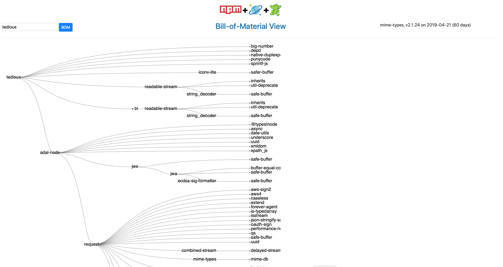

# azure-cosmos-db-graph-npm-bom-sample

An example Bill-of-Material application with NPM data using Azure CosmosDB Graph/Gremlin database.


## Created By

- Chris Joakim, Microsoft, Azure Cloud Solution Architect, Charlotte
- Luis Bosquez, Microsoft, Azure CosmosDB Program Manager, Redmond

## Video Outline

- What is a Bill-of-Material, or BOM?
- What we are trying to solve here?
- The Raw Data used in this project, and how is was Wrangled and loaded into CosmosDB
- Database Design
- Web Application

## Source Code

https://github.com/Azure-Samples/azure-cosmos-db-graph-npm-bom-sample

The intent is to be able to **clone and go** and run this app with your own subscription.

See the README file regarding Azure resource provisioning and the environment variables
this codebase depends on.

---

## What is a Bill-of-Material?

A **Bill-of-Materials** is the complete set of items or components that compose
a larger item, such as a finished product.

It is **hierarchical** in nature, has **depth**, and is difficult to visualize in a tablular format. 

It is also typically **propritary** in nature.

---

## What we are trying to solve here?

This project is actually based on a **real-world proof-of-concept** we created for a client recently.

The client wanted to see four things in the POC:

- A **Visualization** of the BOM for a given product or component
- Integrated **Sales and Inventory** data
- See **"Where Else"** a component was used
- Identify **Risks** in their system and identify high-inventory components used in only one product.
  As market demand changes products can be discontinued, thus leaving them with components that they
  need to allocate to other products.

---

## NPM as the Data Source

In our work with Azure CosmosDB we've seen that **Bill-of-Materials (BOM)** is a common
use-case for companies, especially in the manufacturing sector.

The graph of their manufactured products, and their many nested components, is perfectly
suited for CosmosDB with the Gremlin Graph API.

Industry and company-specific product and component data, however, is both proprietary 
as well as not immediately relatable to most readers.

We wanted to create a BOM sample application with data that was **immediately relatable** to most
Information Technology audiences.  Therefore, we chose the domain of **software**, since software end-products are typically composed of a nested graph of software libraries (i.e. - manufacturing components), and IT audiences innately understand this.

We considered using NuGet (DotNet), MavenCentral (Java), and PyPI (Python) as the datasource.

But we chose  [npm (Node Package Manager)](https://www.npmjs.com) in the Node.js and JavaScript ecosystem as Node.js is fast-growing, appeals to a wide-audience, has great CLI tooling, and CosmosDB itself is JavaScript and JSON oriented.

Given the NPM orientation of this project, **Node.js and JavaScript** was chosen as the implementation language for this project.  JavaScript is widely supported in Azure PaaS services - such as Azure App Service, Azure Functions, and even in CosmosDB for server-side Stored Procedures, Triggers, and UDFs.  It is worth noting that the free and cross-platform Visual Studio Code editor was used for the development of this project.  Visual Studio Code is itself implemented in Node.js.
JavaScript is everywhere!

## Architecture

This application uses a **single Azure CosmosDB account, with the Gremlin API**, as its sole datastore.

There is a **batch process** which **spiders** npm for information about npm libraries, wrangles this JSON data, and then loads it into CosmosDB.

There is also a **web application**, in the webapp/ directory, built with Node.js and Express which queries and displays the CosmosDB data.  The open-source JavaScript library [D3.js](https://d3js.org) is used to visualize
the graph data.

The database design includes **two graphs, or containers**.  One contains the Graph data, with the Vertices being the NPM Libraries and their Maintainers, with Edges connecting libraries to their dependent libraries.  Edges also connect the Maintainers to their respective libraries.

The second container in an implementation of the concept of **materialized views**; a set of data pre-aggregated and pre-processed so as to enable faster queries at runtime.  For example, some of the pre-aggregated data answers the question: "Where else is this library/component used?" and "What other packages does this Maintainer work on?".

Additionally, the materalized views contain pre-calculated library ages - in days and years, based on their original and current version dates.  Pre-aggregating data such as this can significantly reduce the **RU usage** for CosmosDB users, and this is why we are featuring **materialized views** in this sample BOM project.

What's very interesting about the materialized views in this project is that they are accessed via the **CosmosDB SQL API** rather than the **Gremlin API**.  

The materialized views are queried efficiently in this project via their **partition key attribute** whose name is simply 'pk'.  This is actually a best practice - to name your partition key 
attributes with a generic name like 'pk' or 'partition_key' rather than a given business-oriented attribute name.

Currently, this is the only case where a single Azure CosmosDB account can be accessed via two programatic APIs; in this case a Gremlin account accesssed via the Gremlin and SQL APIs.

The advantage of this approach is that your BOM data is in one database, with independent and independently scalable graph and view collections.  It enables expressive graph traversal via the Gremlin API, and also very efficient queries via the SQL API.

See file **webapp/dao/cosmosdb_dao.js** which implements the **DAO Design Pattern** for both the Gremlin and SQL APIs.

---

## Batch Processing Overview

The batch processing does the following:

1) Starts with a hand-edited list of **seed** npm libraries that are interesting to you.

2) Programatically invoke the **npm cli** to recursively **Spider** npm for information about each library.
   - The spider process starts with your hand-edited list of seed npm libraries
   - The spider will iterate n-number of times to get the **dependencies** of those seed libraries
   - Then dependencies of those libraries, and their dependencies, etc, etc
   - The command **npm view library -json** is executed for each library and the JSON response is captured
   - Started with 49 seed libraries, ended up with 650 libraries after 10 iterations
   - This is a small subset of the thousands of libraries available at www.npmjs.com

3) Wrangle the JSON files for each library that are captured in the Spidering process.

4) Generate Gremlin load statements, from the Wrangled data, to insert the **Vertices** and **Edges** for the npm graph.
   - The **Vertices** are the npm libraries as well as their **Maintainers**
   - **Edges** connect one library to another in a **uses** or **used_by** relationship
   - **Edges** also connect the **Maintainers** to each **Library** they maintain
   - Currently there isn't a **knows** Edge from one Maintainer to another within a Library
   - see file data/gremlin/gremlin_load_file.txt

5) Load the Azure CosmosDB/Graph database, **npm collection** from the generated Gremlin statements.

6) Similarly wrangle the data into **Materialized Views** and load these into the database
via the SQL API.  For example, for each library determine where else it is used.  Also 
precalculate the ages of the libraries based on their creation date and current version
date.

7) Load the Azure CosmosDB/Graph database, **views collection** with the materialized views.

---

### What Does the Data Look Like?

[library materialized view - tedious](samples/lib_view_tedious.json)

[maintainer materialized view - dougwilson](samples/maint_view_dougwilson.json)

```
g.V(["tedious", "tedious"]).emit().repeat(outE("uses_lib").inV()).times(16).path().by("id")
```
[tedious dependency graph query results](samples/tedious_dep_greph.json)

---

## Web Application

The Web Application for this project is implemented with Node.js and the Express
web framework.  D3.js is used in the client-side browser code for Graph Visualization.

```
$ cd webapp

$ npm install

$ ./webserver.sh
    ...
    Express server listening on port 3000
    ...
```

Then visit **http://localhost:3000/** with your browser.


## Demo Sequence

- See Splash Screen
- See tedious BOM
- See the two visualizations of the BOM
- Hover over depd
- Click depd for Library info
- Click dougwilson for his maintained libraries!
- Click express in dougwilson list
- Click express BOM link in Library view
- Click debug in the BOM view
- See the many uses of debug in the Library view
- Compare Used-In vs requirements
- Compare Library info dates to sales and inventory values
- Used-in maps to risk


### Web App Screen Shots

#### Splash Screen


---

#### Bill-of-Material View



---

#### Library View


---

#### Maintainer View


---

# Gremlin Queries

```
g.V().count()

g.V(["tcx-js","tcx-js"])
g.V(["tedious","tedious"])
g.V(["express","express"])

g.V(["tcx-js", "tcx-js"]).emit().repeat(outE("uses_lib").inV()).times(16).path().by("id")
g.V(["express", "express"]).emit().repeat(outE("uses_lib").inV()).times(16).path().by("id")

g.V(["MAINT-cjoakim","MAINT-cjoakim"])
g.V(["MAINT-luisbosquez","MAINT-luisbosquez"])
g.V(["MAINT-tjholowaychuk","MAINT-tjholowaychuk"])
```

---

## Summary

The **best practices** this project attempts to show are:
- Use Graph constructs (Vertices, Edges) and the Gremlin API for your Graph-related things
- Use Document constructs (Materialized Views) and the SQL API for metadata relating to the Graph
- Pre-aggregate and Pre-calculate the Materialized Views where possible
- Query by partition key in both cases - Graph and Views
- Use a generic partition key name, like "pk" or "partition_key"
- Use both the Graph and the SQL database API in the same CosmosDB instance!
- D3.js is an effective tool for visualizing graph data

## Thank you
